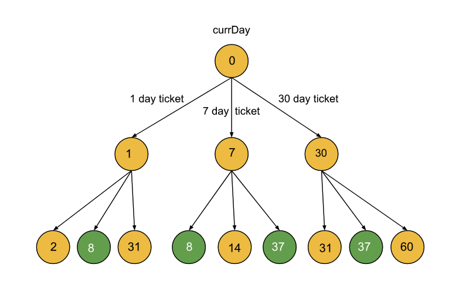

https://leetcode.com/problems/minimum-cost-for-tickets/



### Approach - 1 Top Down

```java
class Solution {

    int len;
    int[] pass = new int[] { 1, 7, 30 };
    int min;
    int[] dp;

    public int mincostTickets(int[] days, int[] costs) {

        len = days.length;

        min = Integer.MAX_VALUE;

        for (int i = 0; i < 3; i++) {
            min = Math.min(min, costs[i]);
        }

        dp = new int[len];
        Arrays.fill(dp, -1);

        return findMinDollars(days, costs, 0);
    }

    private int findMinDollars(int[] days, int[] costs, int index) {

        if (index >= len) {
            return 0;
        }

        if (index == (len - 1)) {
            return dp[index] = min;
        }

        if (dp[index] != -1) {
            return dp[index];
        }

        int min = Integer.MAX_VALUE;

        for (int i = 0; i < 3; i++) {

            int maxDays = days[index] + pass[i] - 1;

            int j = index + 1;
            for (; j < len && days[j] <= maxDays; j++) {

            }

            int currentMin = costs[i] + findMinDollars(days, costs, j);

            min = Math.min(min, currentMin);
        }

        return dp[index] = min;
    }
}
```

---

```java
class Solution {

    int len;
    int[] pass = new int[] { 1, 7, 30 };
    int min;
    int[] dp;

    public int mincostTickets(int[] days, int[] costs) {

        len = days.length;

        min = Integer.MAX_VALUE;

        for (int i = 0; i < 3; i++) {
            min = Math.min(min, costs[i]);
        }

        dp = new int[len];
        Arrays.fill(dp, -1);

        return findMinDollars(days, costs, len - 1);
    }

    private int findMinDollars(int[] days, int[] costs, int index) {

        if (index < 0) {
            return 0;
        }

        if (index == 0) {
            return dp[index] = min;
        }

        if (dp[index] != -1) {
            return dp[index];
        }

        int min = Integer.MAX_VALUE;

        for (int i = 0; i < 3; i++) {

            int maxDays = days[index] - pass[i] + 1;

            int j = index - 1;
            for (; j >= 0 && days[j] >= maxDays; j--) {

            }

            int currentMin = costs[i] + findMinDollars(days, costs, j);

            min = Math.min(min, currentMin);
        }

        return dp[index] = min;
    }
}
```

### Approach - 2 Bottom Up Dynamic Programming

```java
class Solution {

    public int mincostTickets(int[] days, int[] costs) {

        int len = days.length;

        int lastDay = days[len - 1];

        int[] dp = new int[lastDay + 1];

        int index = 0;

        for (int day = 1; day <= lastDay; day++) {

            if (day < days[index]) {
                dp[day] = dp[day - 1];
            } else {
                // Buy a pass on this day, and move on to the next travel day.
                index++;

                // Store the cost with the minimum of the three options.
                dp[day] = Math.min(dp[day - 1] + costs[0],
                        Math.min(dp[Math.max(0, day - 7)] + costs[1],
                                dp[Math.max(0, day - 30)] + costs[2]));
            }

        }

        return dp[lastDay];
    }
}
```